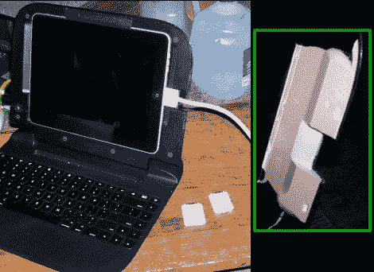

# 打扰一下 IPad，我可以插句话吗？

> 原文：<https://hackaday.com/2011/06/14/excuse-me-ipad-may-i-cut-in/>

[LostSpawn]喜欢他的 iPad 翻盖键盘，但他对这个设计有一个主要的不满。当平板电脑以横向安装时，没有办法插入基座连接器进行充电或其他用途。他拿出切割工具，并根据自己的需要改装了箱子。

这个盒子是一个 Rocketfish 胶囊，当你需要大量打字时，它可以提供一个蓝牙键盘。硬壳保护 iPad 的作用很大，但是谁愿意把它拔出来充电呢？我们不能相信的是，在挡板的另一侧有一个槽，这样你就可以插入耳机。他们是如何忽略了坞站连接器的？

为了自己添加它，[LostSpawn]首先沿着他想要删除的部分钻一条虚线。他用 Dremel 磨平了材料，然后开始打磨平整。为了确保它看起来不太像一个黑客，他用 Bondo 建立工作边缘，然后打磨和油漆工厂完成。现在，他可以插入电缆或 SD 卡适配器，如键盘右侧所示。