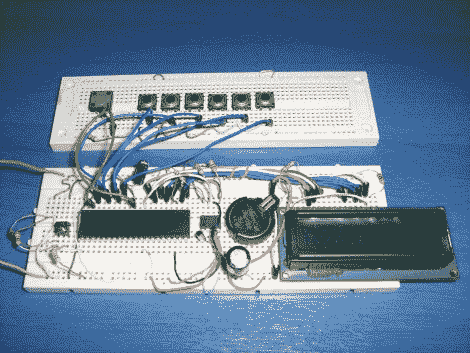

# 简易时钟采用 RTC 芯片和字符显示

> 原文：<https://hackaday.com/2011/06/14/simple-clock-uses-rtc-chip-and-character-display/>

[Giorgos Lazaridis]刚刚完成在试验板上制作一个简单的时钟。它使用通用实时时钟芯片 DS1307。这比它功能齐全的哥哥 [DS3232](http://hackaday.com/2010/04/29/surface-mount-breakout-boards/) 便宜。二者的区别在于，1307 需要一个外部 32.768 kHz 晶振，并且没有温度补偿。这意味着它在长期内不会非常准确(每月可能会漂移多达一分钟)，但它仍然会使使用微控制器作为 RTC 的准确性相形见绌，并包括一个备用电池，当电路的其余部分关闭时，它将保持时间。

本设计使用 PIC 16F1937 在 16×2 字符的液晶显示屏上显示时间和日期。六个按钮专用于递增一个特定的数据块(例如:一个按钮改变年份，另一个按钮改变日期，等等。).使用其他六个按钮时，可以按住第七个按钮来减少设置。我们总是对按钮代码是如何编写的感兴趣。[Giorgos]确实分享了他的代码，但他是用汇编语言写的，所以这对我们没什么用，因为我们倾向于坚持 C 代码。

休息后观看视频演示。

 <https://www.youtube.com/embed/fnpLzQwNQco?version=3&rel=1&showsearch=0&showinfo=1&iv_load_policy=1&fs=1&hl=en-US&autohide=2&wmode=transparent>

 </body> </html>