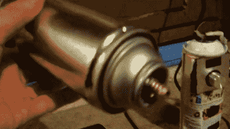

# 自制热风枪从搜刮的部分

> 原文：<https://hackaday.com/2011/06/15/homebrew-heat-gun-from-scrounged-parts/>

一个每日黑客读者需要一个工具来焊接许多 SMD 部件，所以他建造了一个 DIY 热风枪，我们对结果印象深刻。

在网上寻找他的热风枪的想法后，[MRGATZ85]发现大多数建筑使用了廉价烙铁的陶瓷元素。这个方向的实验进行得不太顺利，因为这些熨斗中的陶瓷元件很容易碎裂。灵机一动，[MRGATZ85]意识到他身边有一个旧汽化器，于是决定把它拆开。令他惊讶的是，蒸发器的元素是一个巨大的尺寸，独立的，最重要的是免费的。在用高温泡沫、喷雾罐和插销零件制造了一个箱子之后，[MRGATS85]留下了一个非常漂亮的造型。

除了 SMD 工作之外，热风枪对于 [PCB 剥离](http://hackaday.com/2011/04/08/pcb-parts-salvaging-made-easy/)和用于[回流焊](http://hackaday.com/2011/04/08/pcb-parts-salvaging-made-easy/)也是一个非常有价值的工具。我们有点惊讶我们已经很久没有看到自制热风枪了。即使元件被高温泡沫包围，枪摸起来还是有点热。我们希望这最终会得到控制；否则这是一个非常有用的构建。

休息后，请查看[图像库](http://s1192.photobucket.com/albums/aa329/MrGatz85/)或视频演示。

[https://www.youtube.com/embed/cojjhthZKjo?version=3&rel=1&showsearch=0&showinfo=1&iv_load_policy=1&fs=1&hl=en-US&autohide=2&wmode=transparent](https://www.youtube.com/embed/cojjhthZKjo?version=3&rel=1&showsearch=0&showinfo=1&iv_load_policy=1&fs=1&hl=en-US&autohide=2&wmode=transparent)