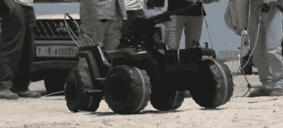

# 利比亚叛军将玩具变成战争武器

> 原文：<https://hackaday.com/2011/06/15/libyan-rebels-turn-toys-into-weapons-of-war/>

他们说在爱情和战争中一切都是公平的——相信我们，[你不必告诉这些家伙两次](http://jalopnik.com/5811839/libyan-rebels-turn-power-wheels-toy-into-tiny-killer-robot-tank)。

随着利比亚战争的激烈进行，叛军已经求助于任何东西来帮助他们占上风。工程师和工程系学生放下工作和学业，成为利比亚革命的建筑师。在一所学校的操场兼武器设施里，来自各行各业的人们一起工作，用废弃零件制造强大的武器。

[Rajab]，该组织的首席武器工程师，过去以开卡车为生。现在，他正在指导他的战友如何最好地将废弃材料和回收的军用武器改造成有效的杀人机器。正如你在下面的视频中看到的，一切都是公平的游戏。他们的创作范围从装有回收战斗机机枪的皮卡车，到被改造成遥控机枪炮塔的动力轮底盘。

用一些废料和一点点聪明才智就能生产出这些东西，真是令人惊奇。

 <https://www.youtube.com/embed/jCyRBUAEneM?version=3&rel=1&showsearch=0&showinfo=1&iv_load_policy=1&fs=1&hl=en-US&autohide=2&wmode=transparent>

 </body> </html>