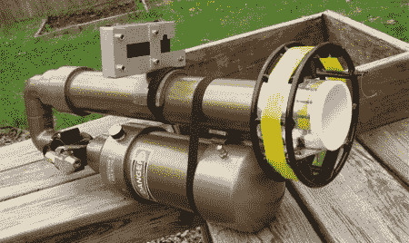

# 业余无线电天线加农炮

> 原文：<https://hackaday.com/2011/06/16/antenna-cannon-for-amateur-radio/>

作为一名业余无线电爱好者，[Andrew]有时不得不架设长达 160 米的即兴天线。让这些天线离开地面最简单的方法是把它们挂在树上，这通常是通过用弹弓或弓箭把钓鱼线放在空中来实现的。[Andrew]认为吊索在上个世纪是如此的*,所以他想出了一个受[spud gun 启发的天线发射器](http://blog.kotarak.net/2011/04/say-hello-to-my-little-friend.html)。*

 *发射器由聚氯乙烯制成，发射一个充满泡沫的网球，可以拉出 150 码的光谱线。灵光一现，[安德鲁]决定添加一个增强现实 HUD。显示器实际上是[Andrew]的手机，运行着一个名为[geo cam](https://market.android.com/details?id=com.myway)的应用程序，为他提供覆盖在手机摄像头上的高度和方位显示。[安德鲁]的体形的[效果](http://blog.kotarak.net/2011/05/antenna-launcher-digital-scope-part-2.html)相当令人印象深刻。这种加农炮能够在 PVC 额定压力一半的情况下将网球抛过 110 英尺高的树。分组也非常紧密，足以在树上运行一行。

[安德鲁]的天线加农炮是一个了不起的作品，不像大多数薯条切割器，它是一个有用的工具。如果你有兴趣看到 160 米长的天线悬挂在树顶上，业余无线电场日将在下个月的 T2 周，也就是 6 月 25 日和 26 日。*