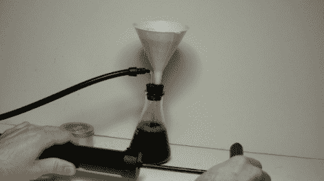

# 制作自己的实验室仪器

> 原文：<https://hackaday.com/2011/06/16/making-your-own-lab-instruments/>

[Andrey Mikhalchuk]正试图收集一套基本的实验室仪器。具体来说，他正在寻找能够让他快速从液体中过滤出固体的硬件。他首先在塑料漏斗中加入一个棉盘。它完成了任务，但是当离开重力时，它非常慢。他需要一种方法来加快流速，即使过滤器被微粒严重堵塞。

这个问题已经有解决方案了。这是一个叫做布氏烧瓶的玻璃容器。这些特点是从颈部伸出一根玻璃管。通过将真空泵连接到这根管子上，烧瓶内的减压会立刻将液体通过过滤器。[Andrey]没有购买特殊物品，而是改装了一个橡皮塞来容纳漏斗和玻璃管。这是一个更便宜的版本，因为它使用一个普通的锥形瓶，但它也一样有效。为了创造真空，[使用了一个改装过的自行车泵](http://www.rtfms.com/rtfms-5-building-a-vacuum-pump.htm)。休息之后，看看这两位黑客的视频。 <https://www.youtube.com/embed/H3jjBv6968I?version=3&rel=1&showsearch=0&showinfo=1&iv_load_policy=1&fs=1&hl=en-US&autohide=2&wmode=transparent>

 <iframe class="youtube-player" width="800" height="480" src="https://www.youtube.com/embed/7lrAcJ67b78?version=3&amp;rel=1&amp;showsearch=0&amp;showinfo=1&amp;iv_load_policy=1&amp;fs=1&amp;hl=en-US&amp;autohide=2&amp;wmode=transparent" allowfullscreen="true" style="border:0;" sandbox="allow-scripts allow-same-origin allow-popups allow-presentation"/> </body> </html>