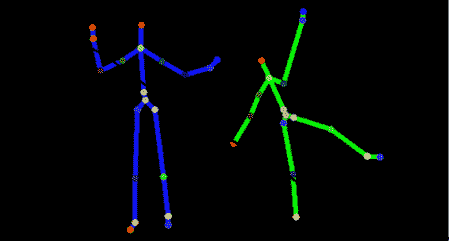

# 官方 Kinect SDK 发布

> 原文：<https://hackaday.com/2011/06/16/official-kinect-sdk-released/>

微软刚刚发布了用于 Windows SDK 的 [Kinect 测试版。虽然，“](http://research.microsoft.com/en-us/um/redmond/projects/kinectsdk/default.aspx)[微软不宽恕对其产品的修改](http://news.cnet.com/8301-13772_3-20021836-52.html)”，但在 Kinect 被正式黑客攻击七个月后，微软似乎改变了态度，发布了 C++、C#和 Visual Basic 的 API。

自从 Kinect 发布以来，我们已经看到了库的开发，在 [OpenKinect](http://openkinect.org/wiki/Main_Page) 项目中达到高潮。微软的发布覆盖了与 OpenKinect 项目相同的领域，并有望改善[从 Kinect](http://openkinect.org/wiki/Protocol_Documentation#NUI_Audio) 获取音频的尝试。

我们已经看到 Kinect hacks 涵盖了从[网真](http://hackaday.com/2011/06/04/amazing-3d-telepresence-system/)，到[机器人](http://hackaday.com/2011/06/03/kinect-driven-cart-makes-shopping-a-snap/)，到 [3D 建模](http://hackaday.com/2011/03/25/kinect-minecraft-trifecta/)的所有领域，因此 Kinect 看起来像是建筑商武库中的一个伟大工具。Kinect 是一个很棒的工具，尽管大部分功能已经被开源社区复制，但很高兴知道我们看到的所有伟大的项目都有官方支持。