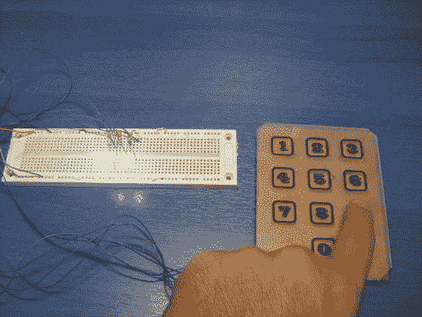

# 键盘使用 PIC 的内置电容功能

> 原文：<https://hackaday.com/2011/06/17/keypad-uses-a-pics-built-in-capacitance-functionality/>

[Giorgos Lazaridis]最近的项目是[建造一个电容触摸板](http://pcbheaven.com/circuitpages/10_buttons_touch_pad_bcd_output/)。因为他用的是 PIC 16F1937，所以相对容易些。这是因为它内置了一个 16 通道电容传感模块。但是还是有一些设计上的考虑让开发有点触动。

这不是他第一次从事电容传感工作。根据过去的经验，他发现将微控制器放置在尽可能靠近按钮板的位置非常重要。因此，芯片焊接在用于键盘本身的 PCB 背面。因为他手工焊接过孔，他还使用了一些泡沫胶带来抬高按钮垫一点点。这样，它们将与丙烯酸覆盖层齐平，由于过孔焊点的原因，丙烯酸覆盖层不能平放在电路板上。

休息之后，请观看视频，听听[Giorgos]为我们介绍这个项目。

 <https://www.youtube.com/embed/2cQ2ht0CYO0?version=3&rel=1&showsearch=0&showinfo=1&iv_load_policy=1&fs=1&hl=en-US&autohide=2&wmode=transparent>

 </body> </html>