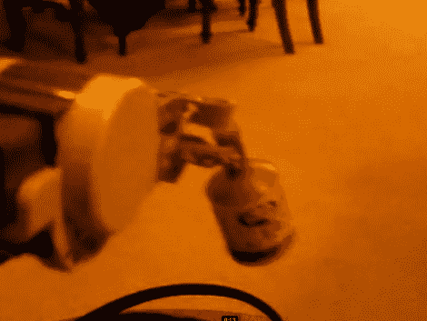

# 派对波普“安全”机器人

> 原文：<https://hackaday.com/2011/06/19/the-party-popper-security-robot/>

这个[“安全”机器人](http://www.youtube.com/watch?v=1h31h7341vY "security robot")基于[乐高头脑风暴](http://mindstorms.lego.com/en-us/Default.aspx "mindstorms") NXT 平台。正如休息后的视频所示，这个机器人能够向机器人主人认为合适的任何入侵者发射“砰”的一声。发射一个爆破筒需要相当大的力量，所以这对于乐高组件本身来说是相当令人印象深刻的。如果你一直在寻找构建下一个机器人的组件，乐高可能值得一看。

据建造这个机器人的 14 岁澳大利亚人说，这个机器人还具有一个高清网络摄像头个人身份系统，当它看到有人时会给他发电子邮件。它使用蓝牙进行控制。自从你们中的一些人在 80 年代和 90 年代建造灰色城堡以来，乐高设计已经走过了漫长的道路。休息后请务必观看视频。

[https://www.youtube.com/embed/1h31h7341vY?version=3&rel=1&showsearch=0&showinfo=1&iv_load_policy=1&fs=1&hl=en-US&autohide=2&wmode=transparent](https://www.youtube.com/embed/1h31h7341vY?version=3&rel=1&showsearch=0&showinfo=1&iv_load_policy=1&fs=1&hl=en-US&autohide=2&wmode=transparent)