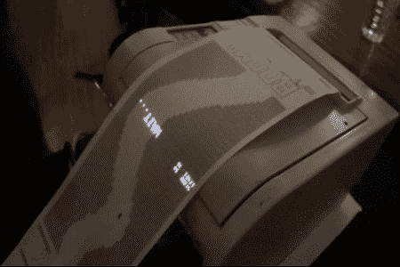

# 收据赛车浪费了很多纸

> 原文：<https://hackaday.com/2011/06/20/receipt-racer-wastes-a-lot-of-paper/>

[Joshua Nobel]和 undef 的团队为 2011 年巴塞罗纳 OFFF 节设计了一款收据打印机游戏。

这个游戏是一个小的 [openFrameworks](http://en.wikipedia.org/wiki/OpenFrameworks) 应用程序，它在热敏打印机上打印一个迷宫。一辆“汽车”被引导通过迷宫，输入来自一个双冲击 3 控制器。这个游戏的最大距离是 50 米，也就是纸卷的长度。我们担心这会浪费纸张，直到 undef 指出，“从生态角度来看，这是一场灾难，就像任何真正的汽车一样。”

undef 团队试图使用打印机来呈现游戏的整个视觉效果，但这并不太可行，直到[约书亚·诺伯]发明了一种“投射器”，将汽车和得分投射到纸上。我们不太确定“beamer”是什么，但一切都同步了，最终的游戏相当不错。

游戏本身让我们想起了某个 flash 游戏，但那不可能是最初想法的来源。休息后查看收据赛车游戏视频。

[https://player.vimeo.com/video/24987120](https://player.vimeo.com/video/24987120)