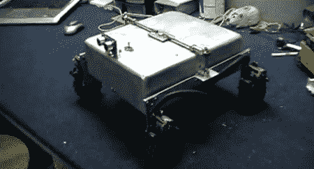

# 将 Roomba 改装成火星漫游车

> 原文：<https://hackaday.com/2011/06/22/converting-a-roomba-into-a-mars-rover/>

当我们第一次听说[Dino]的[全地形 Roomba](http://hackaweek.com/hacks/?p=207) 时，我们希望“爬楼梯 Roomba”的问题最终得到解决，但最终的构建结果要酷得多。

一年前，【迪诺】在[摇臂-转向架悬挂](http://en.wikipedia.org/wiki/Rocker-bogie)的基础上制造了一个[小型机器人](http://www.youtube.com/watch?v=xrPBWtjbHKs)。这种悬挂系统已经在每一辆火星车上使用，包括计划明年登陆火星的巨大的[火星科学实验室](http://marsprogram.jpl.nasa.gov/msl/mission/rover/)。[迪诺]加强了之前版本的悬挂系统，改变了车轮和重心。现在，小小的 Roomba rover 似乎完全有能力爬过和它一样高的物体。

漫游者的控制类似于我们见过的其他 Roomba 黑客——只是利用了几个晶体管。[迪诺]正在使用赛杜伊诺和超声波传感器来避免碰撞。[Dino]说他正在考虑独立转动每个轮子来绕过打滑转向，但也许一个[全向轮](http://en.wikipedia.org/wiki/Mecanum_wheel)会更合适。

休息之后，请观看 Roomba rover 穿越[Dino]车库中危险的布满巨石的地形的演示视频。

[https://www.youtube.com/embed/jNgpl1TL4xg?version=3&rel=1&showsearch=0&showinfo=1&iv_load_policy=1&fs=1&hl=en-US&autohide=2&wmode=transparent](https://www.youtube.com/embed/jNgpl1TL4xg?version=3&rel=1&showsearch=0&showinfo=1&iv_load_policy=1&fs=1&hl=en-US&autohide=2&wmode=transparent)