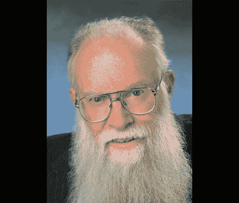

# 鲍勃·皮斯的去世

> 原文：<https://hackaday.com/2011/06/21/the-passing-of-bob-pease/>

我们对[鲍勃·皮斯]最近的去世感到悲痛。你可能不熟悉这个人，但是他的工作已经在很多方面影响了你的生活。作为一名专攻模拟元件的电子工程师，他负责让你生活中的一些电子产品成为可能的硬件，并设计如果你涉足电子设计可能会用到的元件。

EDN 有一份冗长的讣告，颂扬他的一生和成就。[鲍勃]是麻省理工学院 1961 年毕业班的一员。他的职业生涯开始于设计电子管放大器，大约 15 年后，他在国家半导体公司找到了一份工作。在他的职业生涯中，他一直致力于促进模拟电子学的教育，既通过书面文字，最近又担任了 [Analog by Design](http://www.national.com/en/analogu/nationaltv.html) 的主持人，这是一个在线视频节目，由一组专家讨论电子学的来龙去脉。

[鲍勃]于 6 月 18 日死于车祸，享年 70 岁。

[通过[使](http://blog.makezine.com/archive/2011/06/bob-pease.html)