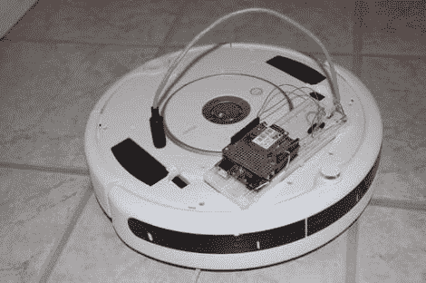

# Roomba 在网上分享它所有的日常活动

> 原文：<https://hackaday.com/2011/06/21/roomba-shares-all-of-its-daily-activity-on-the-web/>

Instructables 用户[matchlighter]想看看他能给他的 Roomba 编程做什么，所以他决定每当有事发生时，就让他的小清洁机器在 Twitter 上报告它的状态。

他打开 Roomba 的外壳，接触到它的串行连接器，用他手头的一些备用 Cat5 制作了一根简单的接口电缆。他在 Roomba 和他的 Arduino 之间添加了一个小型稳压器，以保护它在 Roomba 充电时免受高功率输出的影响。一旦合适的部件就位，他就将 Roomba 的串行接口连接到 Arduino 上，并安装了一个 SparkFun 无线屏蔽，以便进行无线通信。经过一点编码，Roomba 在 Twitter 上与全世界分享它的活动。

他不仅想让 Roomba 发微博，还想让它具备从网络上控制的能力。他利用在网上找到的一个方便的库创建了一个简单的界面，并在短时间内向 Roomba 发送清理命令。

虽然没有 Roomba 运行的视频，但你可以[在这里](http://www.twitter.com/TheRoomba)查看它在做什么，在他的 Instructables 页面上有大量代码。