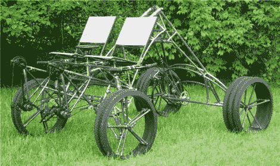

# 四轮摩托车:越小越快

> 原文：<https://hackaday.com/2011/06/21/quadbike-smaller-is-faster/>

在制造了三辆巨大的变异车之后，[汤姆·威尔逊]想:“为什么不制造另一辆？”这一次，他决定组装一款(相对而言)更小、更灵活的双座跑车，他称之为 Boxer。我们介绍了[汤姆]以前的四轮摩托车，[大狗](http://hackaday.com/2010/09/14/quadbike-bigger-is-better/)，它具有类似的管框架，全悬挂，以及熟悉的涵管车轮。这一次[汤姆]实际上用胶合板制作了一个大的夹具，以简化制作过程。拳击手比它的前任轻得多，重量为 125 磅，而大狗的重量为 490 磅，大约矮 4 英尺。更短更轻的车辆使驾驶更加灵活。如果你有兴趣建造自己的四轮摩托车，[汤姆]的[网站](http://www.thirstybeachlandscaping.com/quadbike/page28.html)是一个非常好的资源，有大量的细节。

我们真的很期待在[燃烧人](http://www.burningman.com/)上看到这个最新的作品，看看这个(相对快速的)拳击手在跳跃后的视频吧！

 <https://www.youtube.com/embed/KHLoqKT9Gog?version=3&rel=1&showsearch=0&showinfo=1&iv_load_policy=1&fs=1&hl=en-US&autohide=2&wmode=transparent>

 </body> </html>