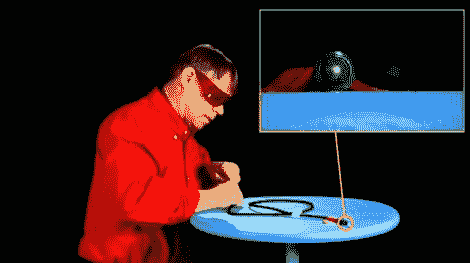

# 工程人员解释光纤

> 原文：<https://hackaday.com/2011/06/21/the-engineering-guy-explains-fiber-optics/>

[工程师比尔·哈马克]带着另一堂课回来了，这门课是关于我们知道并喜爱，但可能并不完全理解的技术背后的科学。这一次大约在[他讨论了光纤布线](http://www.youtube.com/watch?v=0MwMkBET_5I)以及它是如何被用于远距离传输数据的。

他首先展示了激光是如何轻易地从音频级光缆的一端传输到另一端的。为了向我们展示这是如何实现的，他搭建了一个简单的桌面演示，包括一个桶、一些丙二醇和一个绿色激光笔。水桶被修改成一侧有一个透明的窗口，另一侧有一个喷口。激光器被小心地排成一行，当喷口被拔掉时，一股稳定的丙二醇流被释放到第二个桶中。正如[Bill]解释的那样，由于全内反射，激光停留在流体流中，可以在第二个桶中看到它在发光。

[Bill]还讨论了如何在第一条跨大西洋电信电缆中使用光纤，以及如何使用脉冲编码调制通过海底数字链路发送模拟语音数据。

一如既往，[比尔的]视频既有娱乐性又有启发性，所以一定要看看下面。

[https://www.youtube.com/embed/0MwMkBET_5I?version=3&rel=1&showsearch=0&showinfo=1&iv_load_policy=1&fs=1&hl=en-US&autohide=2&wmode=transparent](https://www.youtube.com/embed/0MwMkBET_5I?version=3&rel=1&showsearch=0&showinfo=1&iv_load_policy=1&fs=1&hl=en-US&autohide=2&wmode=transparent)