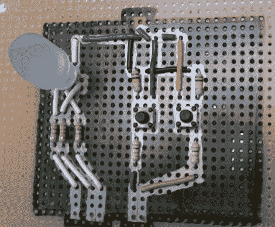

# 推特通知让我们知道我们有多棒

> 原文：<https://hackaday.com/2011/06/22/twitter-notifier-lets-us-know-how-awesome-we-are/>

我们承认吧，你只是有点虚荣。真见鬼，当你仔细想想，我们都有点虚荣。Instructables 用户[pdxnat]非常自恋，以至于他建造了一个 LED“情绪灯”，每当有人在 Twitter 上提到他的用户名时，它就会提醒他。

构建非常简单，大部分工作都在他的个人电脑上完成。他的 Arduino 连接到一个简单的 RGB LED，它平静地循环显示各种颜色，直到有人在 Twitter 上提到他的名字。此时，在他的 PC 上运行的客户端软件通过串行接口向 Arduino 传递一条消息，使其疯狂地向 LED 发出脉冲。一旦它引起了他的注意，他就按下重置按钮停止警报循环，使 LED 返回到之前的状态。作为奖励，他决定用 Processing 和 Python 两种语言编写 Twitter 轮询应用程序，使这两种语言的爱好者能够轻松复制他的工作。

这是一个非常酷的想法，如果能看到有人将它扩展到包括其他在线服务，以提供一个更好的整体感觉，让人们知道他们到底有多棒，那就太好了。

请继续阅读，观看通知程序运行的快速视频。

[https://www.youtube.com/embed/_UpfmQKsjZo?version=3&rel=1&showsearch=0&showinfo=1&iv_load_policy=1&fs=1&hl=en-US&autohide=2&wmode=transparent](https://www.youtube.com/embed/_UpfmQKsjZo?version=3&rel=1&showsearch=0&showinfo=1&iv_load_policy=1&fs=1&hl=en-US&autohide=2&wmode=transparent)