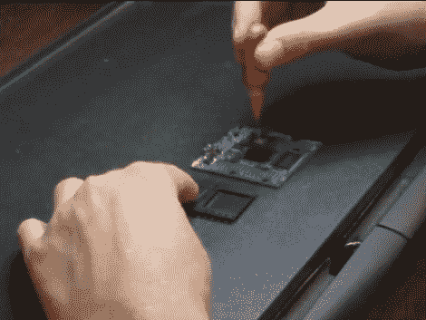

# 在家返工球栅阵列电路板组件

> 原文：<https://hackaday.com/2011/06/22/reworking-ball-grid-array-circuit-board-components-at-home/>

[Jack Gassett]正在为 FPGA 开发新的分线板。芯片采用球栅阵列(BGA)封装，众所周知，这种封装很难可靠焊接。因为他还在研发中，测试板正在他的地下室组装。第一批四块板中，只有一块能正常工作。所以他开始着手[返工坏的电路板](http://papilio.cc/index.php?n=Papilio.JaxHaxBGASolderingAtHome)，我们也跟着一起去了。

为了回流表面贴装元件，他拿起一个便宜的煎饼锅。杰克做的第一件事是加热电路板大约两分钟，然后用真空镊子取下 FPGA 和 FTDI 芯片。接下来，在助焊剂笔、一些焊芯和普通烙铁的帮助下，电路板得到了很好的清洁。一旦清洗干净，他用注射器里的焊膏击打焊盘，开始焊接过程。BGA 封装和焊膏本身通常有制造商推荐的时间和温度指南。[Jack]正在使用煎锅的温度控制器旋钮和 Android 手机上的定时器来跟踪这些配置文件。在休息后的视频中，你可以看到他根据对焊接过程的直觉反应来调整时间。在清理了 FTDI 芯片上的一些焊接桥后，他再次测试，并且成功了！

 <https://www.youtube.com/embed/OkjOwuSEzKU?version=3&rel=1&showsearch=0&showinfo=1&iv_load_policy=1&fs=1&hl=en-US&autohide=2&wmode=transparent>

 </body> </html>