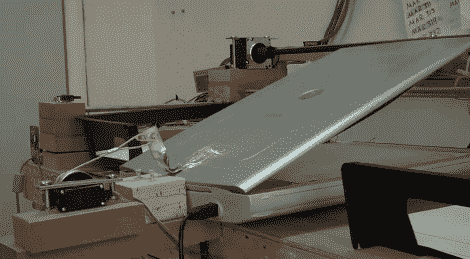

# 自动扫描一堆文件

> 原文：<https://hackaday.com/2011/06/22/automated-scanning-for-a-pile-of-documents/>

加多项目是约翰霍普金斯大学非洲研究中心的一部分。它的任务是归档与东巴尔的摩口述历史项目有关的文件。简而言之，他们有一堆想要数字化的旧图片和文件，但不容易通过逐页扫描，因为它们很脆弱，而且不是标准尺寸。[上面看到的装置是一个自动扫描仪](http://projectgado.org/about-the-project/),它从左边的黑色纸盒中取出一份文件，将其放在中间的平板扫描仪上，并在扫描完成后将其移动到右边的黑色纸盒中。它不是很快，但它是一个便宜的构建(如果你预算紧张的话很棒)，而且它似乎很有效。

机器基本上是一个三轴 CNC 组件。上面你可以看到一个电机，它可以提起扫描仪的盖子。在此图中您看不到文档夹，但请查看休息后显示机器运行的视频。真空动力吸盘在台架(y 轴)上移动，但也能够调整其高度(z 轴)和垂直于台架的距离(x 轴),以便一次抓取一页。

构建日志上的图片有标题，让你知道这是如何构建的。我们没有看到任何关于后期处理的信息，但让我们希望他们有一个自动裁剪和自动去歪斜过滤器，以真正实现自动化。

 <https://www.youtube.com/embed/-QbE3UPDm-w?version=3&rel=1&showsearch=0&showinfo=1&iv_load_policy=1&fs=1&hl=en-US&autohide=2&wmode=transparent>

 </body> </html>