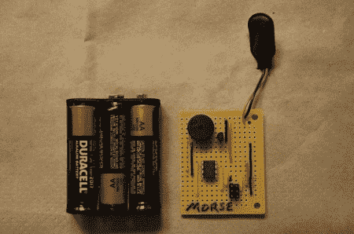

# 微型莫尔斯电码训练器

> 原文：<https://hackaday.com/2011/06/23/tiny-morse-code-trainer/>

[埃里克]想教他的孩子莫尔斯电码，所以他做了一个[微型莫尔斯电码训练器](http://hacks.ayars.org/2011/06/morse-code-trainer.html)。

[Eric]围绕 ATtiny85 建造了训练器，赛道的其余部分遵循这种极简主义的理念。在连接压电传呼机和 6 针 ISP 接头后，剩下唯一要做的事情就是[写一点代码](http://physics.csuchico.edu/~eayars/code/morse.pde.html)并开始教他的孩子莫尔斯。莫尔斯训练器被编程为重复信息，“SOS 月球车坏了，我被困在花园小屋的垃圾桶里，”[Eric]在他的小屋里安放了一个乐高月球车，作为学习莫尔斯的奖励，这使他成为有史以来最酷的爸爸之一。

虽然学习莫尔斯[不再是业余无线电执照](http://www.arrl.org/learning-morse-code)的要求，但它是连续波无线电的要求。我们认为这是一个学习莫尔斯的好方法——实际听到字符——而不是记忆莫尔斯字符的[霍夫曼树](http://en.wikipedia.org/wiki/Morse_code#Alternative_display_of_more_common_characters_in_International_Morse_code)。