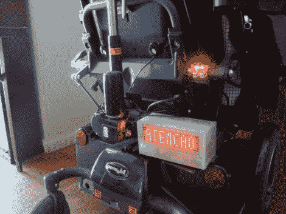

# 通过高能见度使轮椅更安全

> 原文：<https://hackaday.com/2011/06/23/making-wheelchairs-more-safe-through-high-visibility/>

当坐在轮椅上在城市甚至农村地区旅行时，我们认为这很容易被忽视。芮被要求给一辆电动轮椅增加一些灯光和声音，以确保周围的人能看到它。

该系统使用几个不同的组件来确保驾驶员能够被看到。第一个是绑在椅背上的留言板，由预先制作的 8×32 LED 矩阵构成，封装在丙烯酸项目盒中。该板使用 PIC16F88 来存储和显示信息，这些信息由安装在椅子操纵杆附近的控制板触发。他还增加了前灯和尾灯，分别使用明亮的白色和红色发光二极管。椅子上安装了一个 107 分贝的喇叭，以确保如果司机没被看到，他肯定会被听到。

一切看起来都很合适，不妨碍椅子的操作或外观。看看下面的视频，看看他的高能见度系统的行动。

 <https://www.youtube.com/embed/hG8NKjDXHCg?version=3&rel=1&showsearch=0&showinfo=1&iv_load_policy=1&fs=1&hl=en-US&autohide=2&wmode=transparent>

 </body> </html>