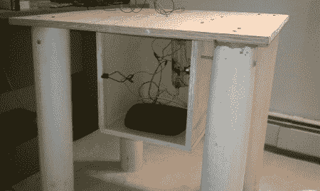

# 无线发射模型火箭

> 原文：<https://hackaday.com/2011/06/24/launching-model-rockets-wirelessly/>

我们喜欢弹道轨迹和早上黑火药的味道，所以我们真的对[Brent Strysko]送来的[无线火箭发射台](http://brentstrysko.com/projects/arlp-automated-rocket-launch-pad/)很感兴趣。

[布伦特]使用了一个带有 enc28j60 以太网屏蔽和无线路由器的 ATmega，在没有与“按钮”物理连接的情况下发射了火箭 launchpad 上的一切都由 12 伏摩托车电池供电，还有一个闪烁的 LED 倒计时。发射火箭所需要的只是从笔记本电脑上发送一个指令。我们认为这将是一个令人敬畏的项目，当它与我们之前提到的[无线电遥测](http://hackaday.com/2011/02/17/model-rocket-radio-telemetry/)结合时——计算机已经和靶场安全员在一起了。

尽管业余火箭发射是非常安全的，没有大功率的飞行撞到人，但是仍然有来自 T2 黑火药引擎的危险。我们认为[布伦特]想出了一个让安全爱好变得更安全的好方法，并在此过程中管理了一个有趣的项目。休息后查看发射台的演练，或查看发射台运行中的视频[。](http://www.youtube.com/watch?v=hBbRDvgAUyQ)

 <https://www.youtube.com/embed/v27LVSugyC4?version=3&rel=1&showsearch=0&showinfo=1&iv_load_policy=1&fs=1&hl=en-US&autohide=2&wmode=transparent>

 </body> </html>