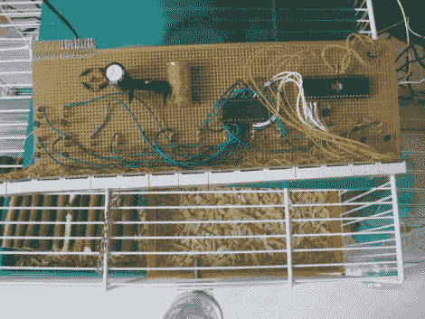

# 密切关注您的宠物忙碌的生活

> 原文：<https://hackaday.com/2011/06/24/keeping-tabs-on-your-pets-busy-lives/>

[斯蒂芬的]女儿有一对她作为宠物饲养的老鼠，它们碰巧在晚上相当活跃。他们在跑步机上疯狂地跑了一晚上，让她保持清醒，之后他们被从她的卧室里搬了出来。由于它们在跑步机上如此活跃，[Stephen]认为测量老鼠每晚实际跑了多少会很酷。

为了跟踪他们的活动，他建立了一个简单的电路来记录跑步机旋转了多少圈。他给它安装了一个稀土磁铁，在表壳外面安装了一个簧片开关，可以记录下轮子的每一次旋转。每当轮子开始移动，他的 PIC 就开始计算转数，并在 7 段 LED 显示屏上显示出来。为了减少断电时的数据丢失，PIC 大约每 10 秒钟在其 EEPROM 中存储一次当前转数。

计数器记录老鼠完成的总回合数，他的女儿用它来手动计算它们的跑步次数。自从他们开始追踪老鼠以来，他们已经跑了 70 多万圈，有时一个晚上完成多达 2 万圈。

我们认为这是一个非常酷的项目，特别是因为它让他的女儿参与到她的宠物的生活中变得很有趣。