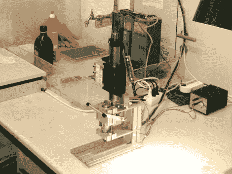

# 半自动印刷电路板钻床

> 原文：<https://hackaday.com/2011/06/25/semi-automatic-pcb-drill-press/>

多亏了[这台半自动钻床](http://www.bastli.ethz.ch/index.php?page=platinenbohrmaschine) ( [译作](http://translate.google.com/translate?js=n&prev=_t&hl=en&ie=UTF-8&layout=2&eotf=1&sl=fr&tl=en&u=http%3A%2F%2Fwww.bastli.ethz.ch%2Findex.php%3Fpage%3Dplatinenbohrmaschine))，告别了钻通孔 PCB 时断钻头的日子。现在，它不会将钻头与孔的准确位置对齐(这将使它成为全自动钻床)。这是通过手动排列木板，然后踩下踏板来激活钻机的突进运动来实现的。

线性电机负责沿 Z 轴平稳、精确的运动。许多爱好设置使用 Dremel 钻床，甚至依赖于基于祈祷的系统，例如用旋转工具徒手完成，或使用一块丙烯酸树脂作为导向孔。爱好钻床往往有一些发挥它和自由处理与玻璃一样脆弱的小钻头都导致太多的坏钻头。在休息后的视频中，您可以看到线性运动与设备的台面完全垂直，防止了导致破损的运动。增加了踏板，便于放置板子，因为你可以用双手操作。

拥有这样的工具可以消除使用通孔零件的所有烦恼。

 <https://www.youtube.com/embed/ou0f08kNjPk?version=3&rel=1&showsearch=0&showinfo=1&iv_load_policy=1&fs=1&hl=en-US&autohide=2&wmode=transparent>

 </body> </html>