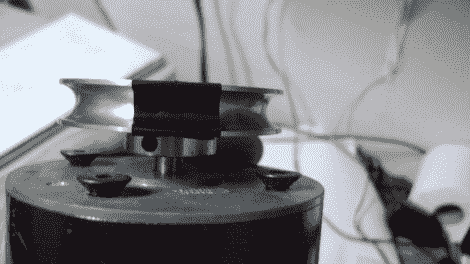

# 用反射式传感器测量转速

> 原文：<https://hackaday.com/2011/06/25/measuring-rpm-with-reflective-sensors/>

[Arao]想用他能从垃圾箱里找到的零件来测量一个纺车的转速。一点思考让他建造了一个反射传感器，可以测量车轮的旋转。

他得到了一个红外光电晶体管，它曾被用作一些消费电子产品的遥控器的一部分。用他的万用表四处窥探帮助他确定了设备的引脚。通过将一个红外发光二极管放置在一个护罩内，但靠近光电晶体管，他可以测量发光二极管的光从附近表面反射回来的强度。上面看到的滑轮上有一块电工胶带。当它经过 LED 时，较少的红外光被反射，光强度的下降被光电晶体管接收。[Arao]通过在电路中加入 LM358 运算放大器，使系统变得坚如磐石。他发布了原理图以及测试期间示波器的一些截屏。