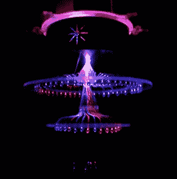

# 一盏漂亮的光纤吊灯

> 原文：<https://hackaday.com/2011/06/25/a-beautiful-fibre-optic-chandelier/>

[Bill]认为他的客厅可以使用更多的光线，或者至少是更多彩的光线。为了满足他的需求，[比尔]设计并建造了他称之为[现代/当代吊灯](http://evolveelectronics.net/?page_id=451 "main link")。吊灯使用约 250 英尺长的光纤电缆来分配八个 LED 的光线，光纤发出的光线通过大理石而不是吊灯中常见的球体进行扩散。

通过一对 Xbee 模块实现无线控制，这将允许[Bill]将其集成到他未来计划的家庭自动化项目中。目前使用三个滑动电位计设置颜色，吊灯使用重新利用的 ATX 电源供电。看起来在丙烯酸外壳上花了很多时间，这是值得的，因为结果太棒了。查看他的网站，了解建造细节，休息后观看吊灯演示的视频。

[https://www.youtube.com/embed/82Opzb4D_8g?version=3&rel=1&showsearch=0&showinfo=1&iv_load_policy=1&fs=1&hl=en-US&autohide=2&wmode=transparent](https://www.youtube.com/embed/82Opzb4D_8g?version=3&rel=1&showsearch=0&showinfo=1&iv_load_policy=1&fs=1&hl=en-US&autohide=2&wmode=transparent)