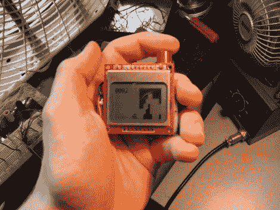

# ATtiny13 动力手持直升机游戏

> 原文：<https://hackaday.com/2011/06/26/attiny13-powered-handheld-helicopter-game/>

[欧文]刚刚完成组装一款便携式直升机游戏。这非常令人印象深刻，尤其是因为他使用了 ATtiny13 微控制器。该芯片采用 8 引脚 dip 封装，仅提供 5 个 I/O 引脚(如果使用 reset 引脚，则为 6 个)和 1k 的编程空间。

这款游戏在一个小型手机型液晶显示屏上运行。当组成游戏棋盘的迷宫一步一步接近时，直升机仍然在屏幕中间的某个位置。控制直升机的单个按钮在按住时会随着迷宫的每一步升高它，或者在松开时让它下降。玩家的进度以十六进制数值显示在屏幕的左上角。当你撞上一堵墙时，你的分数将显示在游戏的最高分数旁边，如果是新的记录，将保存在 EEPROM 中。随着游戏的进行，迷宫会根据分数变得更难。休息之后，请观看视频片段。

 <https://www.youtube.com/embed/p_Sm2s3hkeo?version=3&rel=1&showsearch=0&showinfo=1&iv_load_policy=1&fs=1&hl=en-US&autohide=2&wmode=transparent>

 </body> </html>