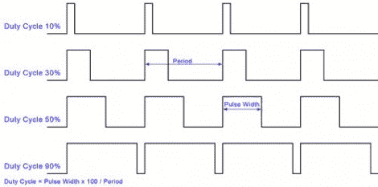

# 用微控制器进行脉宽调制

> 原文：<https://hackaday.com/2011/06/26/pulse-width-modulation-with-microcontrollers/>

那些关注 ProtoStack 教程的人会很高兴听到有一个解释脉冲宽度调制的新版本。如果你以前从未听说过 PWM，它是一种产生信号的方法，该信号在部分时间为逻辑 1，在其余时间为逻辑 0。这是最常用的 LED 调光方法，也是本教程中[Daniel]的例子。但你也会发现它也用于许多其他应用，如伺服电机控制和压电扬声器控制。

[Daniel]首先简要解释了占空比，然后介绍了一些硬件和软件 PWM 示例。许多 AVR 微控制器都具有硬件 PWM 特性，允许您配置基于目标定时器值触发的引脚。这是使用 ATmega168 演示的，但如果没有可用的硬件 PWM 引脚，也可以使用中断和自己的代码。