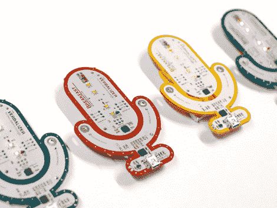

# 没有会议的徽章

> 原文：<https://hackaday.com/2011/06/26/a-badge-without-a-conference/>

几天前，当它第一次在互联网上跳动时，我们看到了它，但从未仔细观察过它。今天，当我们在提示框中看到一个直接链接时，是宣传片(插播在广告之后)吸引了我们。一旦你深入了解了描述者的细节，我们认为你会同意这是一个可破解的会议徽章，不需要参加会议。

正如你可能从 PCB 的设计中猜到的，这是一个麦克风。它旨在与谷歌新的语音搜索功能配合使用，并通过蓝牙模块连接到电脑。但实际上，它只是另一个额外增加了一些位的滚动式 Arduino。你会发现一个 ATmega328 和一个 FTDI 芯片，它提供了一个用于编程的 USB 接口。真正的乐趣始于麦克风和扬声器电路，它们正等着在家里进行试验。在查看原理图时，我们还发现了其他一些东西(可通过下载产品文档和原理图包获得)。看起来有一些电容触摸…你什么？如果你自己找到这些东西，是不是更有趣，有点像 DEFCON 徽章中隐藏的宝石？

[https://www.youtube.com/embed/tBALwwfFNV4?version=3&rel=1&showsearch=0&showinfo=1&iv_load_policy=1&fs=1&hl=en-US&autohide=2&wmode=transparent](https://www.youtube.com/embed/tBALwwfFNV4?version=3&rel=1&showsearch=0&showinfo=1&iv_load_policy=1&fs=1&hl=en-US&autohide=2&wmode=transparent)