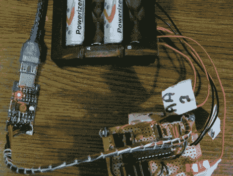

# DIY 电池修复器从垃圾填埋场拯救旧充电电池

> 原文：<https://hackaday.com/2011/06/26/diy-battery-reconditioner-saves-old-rechargeable-batteries-from-the-landfill/>

Instructables 用户[msuzuki777] [多年来收集了相当多的电池](http://www.instructables.com/id/Battery-Reconditioner)，但发现他的一些可充电 AA 和 AAA 电池似乎已经到了使用寿命的尽头。在[电池大学](http://batteryuniversity.com/learn/article/how_to_restore_nickel_based_batteries)读了一些关于镍基电池修复过程的信息后，他想他也可以试着建造一个自己的电池修复器。

他完成了几个设计，要么是全力以赴不起作用，要么是存在限制他可以同时修复的电池数量的问题。在阅读了我们几个月前推出的这款[充电电池容量测试仪](http://hackaday.com/2011/02/10/rechargeable-battery-capacity-tester/)后，他准备再试一次这个项目。

第三次尝试似乎很成功，因为他基于 FET 的设计非常有效。他最终为每个电池连接了两个场效应晶体管，通过继电器连接。电池放电，直到电压降至 1V，此时一个 FET 关闭，使电池更慢地达到 0.4V 的目标电压。

尽管他自称电路布局混乱，[msuzuki777]对结果相当满意。他已经能够回收几个电池，这是一个让它们在垃圾填埋场腐烂的绝佳选择。