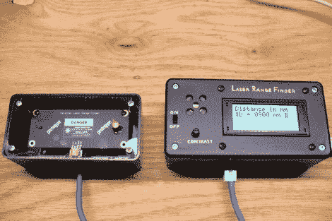

# 汽车倒车报警器

> 原文：<https://hackaday.com/2011/06/26/automotive-backup-alarm/>

[迪诺]本周的项目是[你汽车的倒车报警器](http://hackaweek.com/hacks/?p=219)。这是一个在许多大型车辆上流行的功能，如 SUV，倒车时能见度是一个问题。但听起来他的动机并不是想在自己的车里装上这个。相反，他在用激光测距仪寻找可以建造的东西。

[Joe Grand]([DEFCON 徽章背后的大脑](http://hackaday.com/2009/08/04/defcon-17-badge-hacking/))一直在研究[一种廉价的视差激光测距仪](http://forums.parallax.com/showthread.php?126496-Joe-Grand-s-Laser-Range-Finder-A-Development-Diary)。他将第一批原型板之一送到[Dino]进行测试，我们很高兴[Dino]决定展示它。它使用一个小型红色激光二极管和一个相机模块来测量毫米距离。该板串行通信，该特定项目使用 Arduino 以及字符 LCD 和扬声器来显示距离，并在汽车距离物体一米以内时发出警报。

休息之后，请观看视频，了解整个构建过程。如果你要击中的物体与激光点完全对齐，这个系统工作得相当好。

 <https://www.youtube.com/embed/nGW7AEqEiWQ?version=3&rel=1&showsearch=0&showinfo=1&iv_load_policy=1&fs=1&hl=en-US&autohide=2&wmode=transparent>

 </body> </html>