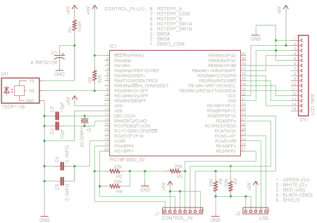

# XBMC 控制器是一款适用于 HTPCs 的一体化 Usb 解决方案

> 原文：<https://hackaday.com/2011/06/27/xbmc-controller-is-an-all-in-one-usb-solution-for-htpcs/>

在最初的 Xbox 上，XBMC 是一个纯软件解决方案(假设你有一个芯片或软调制的控制台)。这是因为 Xbox 本来就可以连接到电视上，通过红外遥控器工作。现在，XBMC 软件已经转移到更广泛的硬件上，在 HTPC 上获得同样的功能可能会更复杂。意识到这一点，【Dilshan】开发了[一个 USB 连接的 XBMC 控制器](http://jayakody2000lk.blogspot.com/2011/06/xbmc-usb-controller-for-media-center.html)，它具有一个红外接收器、字符 LCD 和一个带两个按钮的旋转编码器。

只要您的 HTPC 有办法连接到您的电视上的音频和视频输入，这应该会照顾到演示的其余部分。LCD 屏幕很早就在 XBMC 很受欢迎，因为 modchips 包含一个接口。因此，XBMC 已经开始以这种方式提供导航和媒体信息。因此，您可以使用 XBMC 进行音频播放，而无需打开电视。除此之外，您还可以使用遥控器或前挡板上的导航工具来控制您的机顶盒，这就是一个成功的解决方案。

你可以在项目库的[下载一个包含关于这个设备的所有信息的档案。为了您的方便，休息之后，我们在包中嵌入了项目的原理图和 PDF 描述。](http://elect.wikispaces.com/XBMC+USB+Controller)

[ [PDF 项目说明](http://hackaday.com/wp-content/uploads/2011/06/mcci.pdf)