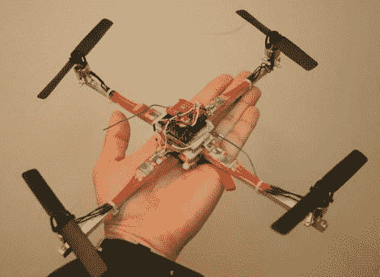

# 基于 MSP430 的掌上型四轴直升机

> 原文：<https://hackaday.com/2011/06/27/msp430-based-palm-size-quad-copter/>

[Thanh]已经花了一些时间驾驶 12 英寸马达对马达的四轴飞行器，但他想造一些更小的东西，这样他就可以在室内飞行。他实际上建造了五架不同的四轴飞行器，从 10 英寸到 3 英寸不等。

在他的论坛帖子中，他强调了他的 10 英寸直升机的建造过程，非常详细地涵盖了每个步骤。虽然他根据电机跨度将他的元件列表分为两类，但一个常见的项目是基于 TI MSP430 的控制板。特别是，他使用了 eZ430-RF2500 开发套件，该套件具有内置 2.4 GHz 无线电的额外优势。他的四轴直升机使用 Wii Motion Plus 陀螺板来帮助保持飞行，以及其他一些我们大多数读者应该非常熟悉的组件。

很高兴看到建筑分解如此详细，我们想象这将是一个伟大的资源，任何人都希望建立自己的四轴直升机。

留下来看看他的迷你四轴直升机的快速视频演示。

[Thanks, Panikos]

 <https://www.youtube.com/embed/4tLiZxjQrVg?version=3&rel=1&showsearch=0&showinfo=1&iv_load_policy=1&fs=1&hl=en-US&autohide=2&wmode=transparent>

 </body> </html>