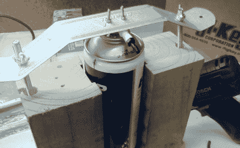

# 锡膏分配器被黑客攻击，导致压缩空气罐泄漏

> 原文：<https://hackaday.com/2011/06/27/solder-paste-dispenser-hacked-to-run-off-compressed-air-cans/>

[约翰]便宜地得到了一个闪亮的新锡膏分配器,在他连接工具之前，他决定看看里面以确保一切正常。除了[一些他不赞成](http://johnsexploits.blogspot.com/2011/06/my-kh228-solder-paste-dispenser-part-1.html)的有问题的布线做法，其他一切看起来都工作正常。

唯一困扰[John]的是，他不太喜欢将他的噪音大的空气压缩机放在车间里，所以他开始寻找一种不同的方法来为设备提供压缩空气。他选择了空气除尘器，就像那些用于清理键盘碎屑的除尘器，但他需要找到一种可靠的方法将空气输送到他的焊锡分配器。他加热空气罐的喷嘴，直到他能够将他的分配器的软管倒钩拧入其中，形成紧密的密封。将改进的喷嘴重新连接到罐上，并放置在简单的夹具中，该夹具使喷嘴持续保持向下。

[John]启动他的分配器，来自除尘器的 80 psi 压力足以让焊膏流动。当然，钻机可能不是最高科技的解决方案，但我们认为这是一个很好的方式来获得安静的压缩空气在任何地方你需要它。