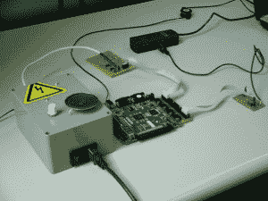

# FPGA MIDI 接口

> 原文：<https://hackaday.com/2011/06/28/fpga-midi-interface/>

黑客和数字音乐似乎是非常相关的艺术。这个非常[好的黑客](http://michhimself.com/blog/yearproject-fpga-midi-synth/ "MIDI synth")经历了使用现场可编程门阵列(FPGA)和几个其他组件创建 MIDI 合成器的过程。

一台笔记本电脑被用作 MIDI 接口，它通过一个滤波器，然后到达 FPGA。然后，转换后的信号经过数模转换器，最终到达放大器和扬声器。FPGA 特别有趣，因为这种芯片是一个逻辑门阵列，可以按照你想要的方式编程。在这种情况下，波表原理用于产生声音。

虽然这还不是 Kaossilator，但这款设备是一个很好的开端，非常实用。如果你曾经想建立自己的电子乐器，看看这个黑客。还有，休息后看看视频！

[https://www.youtube.com/embed/c1_gluixbdE?version=3&rel=1&showsearch=0&showinfo=1&iv_load_policy=1&fs=1&hl=en-US&autohide=2&wmode=transparent](https://www.youtube.com/embed/c1_gluixbdE?version=3&rel=1&showsearch=0&showinfo=1&iv_load_policy=1&fs=1&hl=en-US&autohide=2&wmode=transparent)

另一个非常酷的音乐黑客，看看这个机器人爵士乐合奏团。