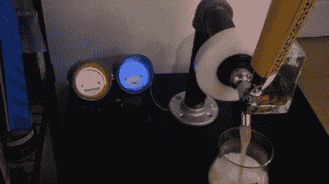

# 借助这款亮灯仪表组，让所有人的目光都集中在您的 Kegerator 上

> 原文：<https://hackaday.com/2011/06/28/keep-all-eyes-on-your-kegerator-with-this-light-up-gauge-cluster/>

几年前,[Evan]用一个迷你冰箱造了一个啤酒冰箱，他对自己的新啤酒冰箱非常满意。像我们许多人一样，他开始想办法在项目完成后尽快改进它。虽然花了几年时间，[他最近开始着手添加他一直想要的温度和容量表](http://battlesnake.blogspot.com/2011/06/fun-with-sensors.html)。

他在冰箱上加了一个温度探头，然后制造了一对工具，可以用来测量桶里还有多少啤酒。容量监视器包括一个使用 SparkFun 的一对压力传感器构建的秤，以及一个安装在啤酒管道中的流量传感器。

[Evan]得到一个旧的 Chevy 仪表组，并在安装一对模拟仪表之前将其清理干净，他用这些仪表来显示小桶的温度和“燃料”水平。因为他觉得没有一些 LED 的爱就没有一个项目是完整的，所以他毫不犹豫地增加了一些。当小桶闲置时，发光二极管平静地跳动，但当流量传感器被激活时，发光二极管就会活跃起来并开始闪烁。

正如[这对](http://hackaday.com/2009/09/10/sparkfun-kegerator-goes-to-eleven/)的[小桶监控系统](http://hackaday.com/2009/12/14/monitor-keg-volume-co2-and-temp/)所证明的那样，我们认为当涉及到你的啤酒储藏时，你永远不会有足够的信息，所以我们真的很喜欢这个项目是如何走到一起的。

请务必在下面的视频中查看他的 kegerator 仪表组。

[https://www.youtube.com/embed/A4cuNhe1pgk?version=3&rel=1&showsearch=0&showinfo=1&iv_load_policy=1&fs=1&hl=en-US&autohide=2&wmode=transparent](https://www.youtube.com/embed/A4cuNhe1pgk?version=3&rel=1&showsearch=0&showinfo=1&iv_load_policy=1&fs=1&hl=en-US&autohide=2&wmode=transparent)