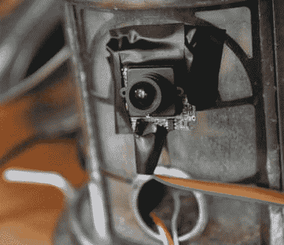

# Tweeting Bird Feeder 保留了所有游客的图片记录

> 原文：<https://hackaday.com/2011/06/28/tweeting-bird-feeder-keeps-a-picture-record-of-all-visitors/>

如果你还不知道的话，Adafruit Industries 正在 Instructables 赞助“让它发推特”比赛，这个可以发推特的喂鸟器是卡西本的参赛作品。

他的喂鸟器不仅向 Twitter 发送消息，还向 Twitpic 发送每只鸟的图片。进料器本身是一个标准的现成模型，装有一个 LinkSprite 摄像机。LilyPad Arduino 控制相机，通过一对 XBee 模块将图像发送到他的计算机。为了探测鸟儿何时停下来吃东西，[卡西本]使用了一个红外 LED 和一个 IR 探测器。发射器和检测器位于进料器开口的相对两侧，每当光束中断时，Arduino 就会触发拍照。一旦图像被传输到他的电脑上，它就会被发布到 TwitPic 上。

我们很确定[卡西本]建造这个鸣叫喂鸟器只是因为他可以，但我们认为对于那些没有空闲时间凝视窗外院子的人来说，这是一个非常聪明的想法。这是一个伟大的方式来保持标签上所有新的有翼访客，而去。