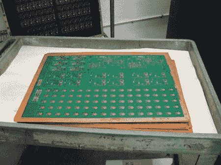

# 先进电路之旅——PCB 制造商

> 原文：<https://hackaday.com/2011/06/29/tour-of-advanced-circuits-a-pcb-manufacturer/>

虽然本身不是黑客，但你们中的许多人可能有兴趣了解印刷电路板在制造业中是如何制造的。这个[高级电路之旅](https://www.base2.us/index.php?page=ac)很好地解释了这个过程。本文解释了 PCB 如何通过 CAD/CAM 审查、钻孔、去毛刺以及各种化学蚀刻、电镀和固化过程。

虽然许多黑客制作自己的 PCB，但根据需要的拷贝数量，让专业人员来做也是一个不错的选择。这样做的一个好处是，多氯联苯可以通过光学检查过程进行检查，甚至可以通过在计算机控制的设置中自动接触引线的“飞线”机器进行检查。

休息之后，我们将播放这台不可思议的机器的视频。0:26 左右是它真正开始运转的时候。

[https://www.youtube.com/embed/UIY3JNdXa2o?version=3&rel=1&showsearch=0&showinfo=1&iv_load_policy=1&fs=1&hl=en-US&autohide=2&wmode=transparent](https://www.youtube.com/embed/UIY3JNdXa2o?version=3&rel=1&showsearch=0&showinfo=1&iv_load_policy=1&fs=1&hl=en-US&autohide=2&wmode=transparent)