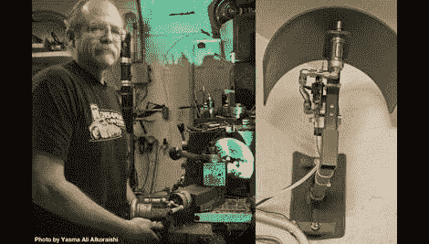

# 声音大得足以吵醒死人的门铃

> 原文：<https://hackaday.com/2011/06/29/a-doorbell-loud-enough-to-wake-the-dead/>



[Ed Nauman]经营一家机械商店，我们可以想象它有时会很吵。当他忙于工作时，他厌倦了从来没有听到过门铃，他决定用一个新的门铃来解决他的问题… [一个令人难以置信的大门铃](http://www.designnews.com/author.asp?section_id=1362&doc_id=230768)。

他的非常响的门铃(简称 RLD)实际上是一个非常简单的装置。我们想象他可以用一个旧的闹钟代替，但是这有什么意思呢？门铃是用 PIC16F876 uC 制造的，用来控制通过气动阀的气流。当有人按门铃时，气动致动器上下跳动，迅速撞击一根 1/4 英寸厚的钢管。正如你在下面的视频中所看到的，它的声音很大，很可能会毫无困难地穿过任何商店的噪音。

在之前，我们已经看到过一些[非常响的门铃，但是我们认为你们中至少有一些人在类似的环境中工作——你们在工作场所实施过任何创造性的‘通知’系统吗？请在评论中告诉我们。](http://hackaday.com/2010/05/16/lunkenheimer-steam-whistle-doorbell/)

[via [Adafruit 博客](http://www.adafruit.com/blog/2011/06/28/the-microcontroller-operated-pneumatically-actuated-rld-really-loud-doorbell/)

```
				 <param name="bgcolor" value="">
					<param name="width" value="470">
					<param name="height" value="412">
					<param name="playerID" value="991410168001">
					<param name="@videoPlayer" value="1020983766001">
					<param name="playerKey" value="AQ~~%2CAAAAAETaO0s~%2CcVbOypIs9tHUVW57d5nJxZGxNa9O_LLK">
					<param name="isVid" value="1">
					<param name="isUI" value="1">
					<param name="dynamicStreaming" value="true">
					<param name="autoStart" value="false">
					<param name="secureConnections" value="true">
					<param name="secureHTMLConnections" value="true"> 
```