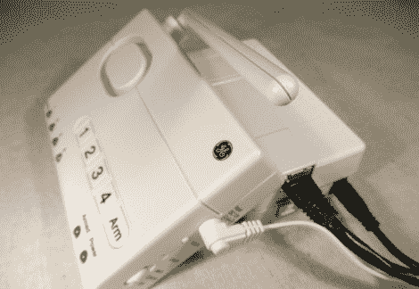

# 推特家庭报警系统

> 原文：<https://hackaday.com/2011/06/30/tweeting-home-alarm-system/>

Instructables 用户[willnue]想要从头开始建立一个 DIY 的推特报警系统，但在仔细研究了这样一个项目的范围后，又重新考虑了。他决定使用现成的安全系统，[自己负责 Twitter 界面。他买了阿格 45142 无线报警器，并迅速将其拆开，看看如何从该装置中检索状态信息。](http://www.instructables.com/id/AlarmingTweet)

他认为监控报警器的发光二极管最有意义，所以他使用了一点以太网电缆，并将系统的所有指示器连接到他的 Arduino 板上。他在 Arduino 上连接了一个以太网屏蔽，然后将两者包装在一个塑料项目盒中，该项目盒与安全系统的外观非常匹配。完成后，他为 Arduino 编写了一些简单的代码，用于监控报警系统的六个状态灯，通过 ThingTweet 服务向 Twitter 发送更新。

有了这个系统，你可能无法及时收到你的状态信息来阻止任何人偷走你的等离子电视，但至少你会知道一旦你回家会发生什么！

如果你想监视威尔的安全系统，找出抢劫他的最佳时间，看看事情进展如何，T2 可以点击这里查看他的推特信息。