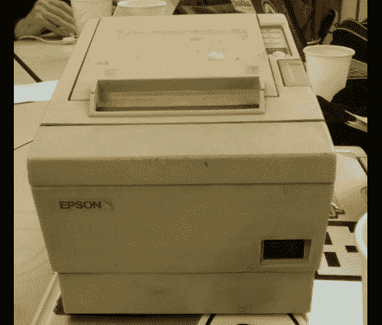

# 驾驶和旧收据打印机

> 原文：<https://hackaday.com/2011/06/30/driving-and-old-receipt-printer/>

最近收据打印机似乎很受欢迎，成为黑客攻击的目标。除了废纸，它们比普通的老式闪烁 led 更酷，我们可以想象有大量的 led 漂浮在外面，因为技术的进步促使零售商用笨重的恐龙来换取更纤薄的热敏打印机。[Philip Hayton]在某种类型的设备拍卖会上买了这个 Epson 模型，并开始研究如何控制它。

该单元通过并行接口寻址。在评估了引脚排列并查找了一点协议信息后，[Philip]连接上他的 Arduino 并打印出一条合适的第一条信息，上面写着:“Hello World”。当你试图与你不熟悉的硬件交谈时，他有一些技巧可以让你学习。

需要一个理由去寻找自己的收据打印机吗？看看这款[纸质游戏系统](http://hackaday.com/2011/06/20/receipt-racer-wastes-a-lot-of-paper/)来寻找一些灵感。现在开发你自己的纸张回收设置，我们可以将它归档在“[绿色黑客](http://hackaday.com/category/green-hacks/)”下。

[谢谢安迪]