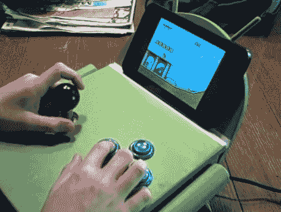

# 安德洛卡德是一个控制者，站在其中

> 原文：<https://hackaday.com/2011/06/30/androcade-is-a-controller-and-stand-in-one/>

我们还记得复古游戏需要大量设备和大量时间来组装游戏界面。[Scooter2084]证明了我们已经通过这款为补充 Android 硬件而构建的[游戏控制器取得了长足的进步。](http://silverballsoftware.com/androcade-android-arcade-controller-part-1)

从上面的图片看不出来，但控制器本身看起来就像机器人安迪。他的头向上倾斜，充当平板电脑支架，而他的躯干则负责控制。我们不知道胳膊和腿的功能用途，但它们是完成造型的必要元素。

传统上，街机控制使用黑客游戏手柄，或专用硬件，如使用 iPac 控制板的 [MAME 机柜](http://hackaday.com/2010/05/30/child-sized-cocktail-cabinets/)。但是这种再现使用 Arduino 来连接操纵杆和四个按钮。蓝牙盾可以让你无线控制 Android 设备，并为基于笔记本电脑的模拟器等设备提供控制器。休息之后不要错过视频。

 <https://www.youtube.com/embed/4nhah_YujOM?version=3&rel=1&showsearch=0&showinfo=1&iv_load_policy=1&fs=1&hl=en-US&autohide=2&wmode=transparent>

 </body> </html>