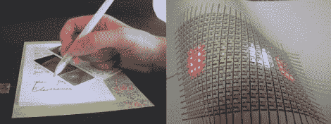

# 新型导电墨水允许用纸笔制作电路原型

> 原文：<https://hackaday.com/2011/06/30/new-conductive-ink-allows-circuit-prototyping-with-a-pen-and-paper/>

当你真正需要的只是一支圆珠笔和一些纸时，为什么还要花时间去蚀刻电路板和涂阻焊膜呢？这是伊利诺伊大学的教授(Jennifer Lewis 和 Jennifer Bernhard)在着手研究将导电墨水加入标准圆珠笔的可能性时提出的问题。

他们的研究成果是一种基于银纳米粒子的墨水，这种墨水在笔内保持液态，但一旦应用于纸张等多孔表面，就会干燥。一旦干燥，这种墨水可以用来导电，就像电路板上的铜迹线一样，使动态电路建设变得轻而易举。

以前基于墨水的电路构造通常是使用喷墨打印机或喷枪完成的，因此从过程中去除额外的硬件是一个巨大的进步。该团队甚至为那些认为可写墨水不能长期使用的人带来了一些消息。令人惊讶的是，这种墨水对物理操作非常有弹性，他们发现，在墨水通路开始失效之前，纸基底需要折叠几千次。

虽然我们知道这无法取代蚀刻精美的电路板，但只要在一张纸上画出连接，就能制作出简单电路的原型，这将非常酷——我们迫不及待地想看到这种产品上市。