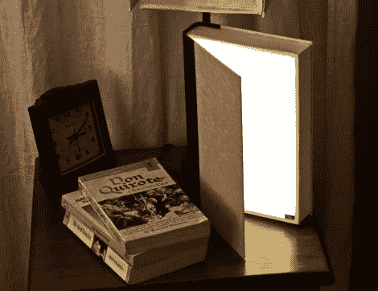

# 不是你普通的 LED 书灯

> 原文：<https://hackaday.com/2011/07/02/not-your-ordinary-led-book-light/>

[史蒂夫·霍弗]并不热衷于传统的台灯，所以他开始自己制作一款比普通台灯更美观的阅读灯。他认为用一本书来建造他的台灯是非常合适的，我们倾向于同意。

他从旧货店找到的一本旧书上撕下书页，然后用胶合板框架填充最近空出来的地方。第二个框架建在第一个框架内，以支持安装一些温暖的 LED 灯条以及他用来漫射光线的丙烯酸板。框架的角落里安装了一个触须开关，当书打开时，它就会打开灯。这种灯发出的光相当于一个 40W 的灯泡，可以通过简单地调节盖子打开的程度来“变暗”。

它放在他的床头柜上看起来棒极了，就像他的其他一些与书相关的东西一样，它也非常有用！

一定要看看我们在下面嵌入的光的构造的视频。

<https://player.vimeo.com/video/25118139>

 </body> </html>