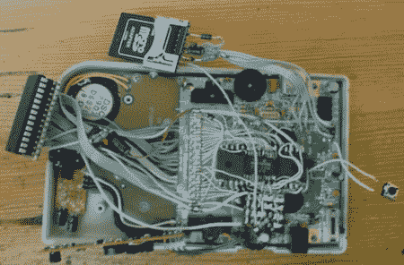

# Game Boy 直接与 SD 卡通信

> 原文：<https://hackaday.com/2011/07/02/game-boy-communicates-directly-with-an-sd-card/>

[kgsws]刚刚完成他的 Game Boy 升级，允许他从 SD 卡加载游戏。从 SD 卡上下载游戏以前也做过，但是[kgsws]决定不使用基于卡带的设备。最终，他抛开一切障碍，通过让[游戏男孩直接访问 SD 卡](http://zdoom.ic.cz/gameboy.html)完成了他的项目。

[kgsws]他的项目试图找出如何在游戏卡带上放置一些 GPIO 引脚，但认为这将占用太多硬件。看了链接端口的规格后，他意识到极性不对。没有被吓住，[kgsws]意识到在游戏机上有一些类似于的通用 I/O 的东西——T2 游戏手柄输入。

在弄清楚通过游戏手柄访问 SD 卡的逻辑后，[kgsws]开始着手在 EEPROM 上构建 FAT32 解析器和简单的 BIOS。整个系统运行在一个 ATmega32 上，他很友好地包括了[原理图](http://zdoom.ic.cz/sdgb/sdgb.png)和[所有的代码](http://zdoom.ic.cz/sdgb.zip)。最终的结果真的很棒——它可以加载和保存 512kB 的 Game Boy ROMs，并保存数据，读取。txt 文件。作为一个额外的奖励[kgsws]放入一个定制的引导标志，以取代顶部滚动的任天堂标志。

虽然当 SD 卡被访问时，游戏手柄按钮不起作用，电池消耗比已经很耗电的 DMG-001 还要大，但我们对[kgsws]的硬件黑客技术感到惊讶。下面来看看【kgsws】被黑的视频。

 <https://www.youtube.com/embed/8tcam0vDfhY?version=3&rel=1&showsearch=0&showinfo=1&iv_load_policy=1&fs=1&hl=en-US&autohide=2&wmode=transparent>

 </body> </html>