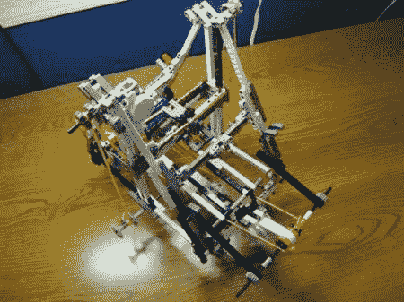

# 由乐高零件制成的绘图仪

> 原文：<https://hackaday.com/2011/07/06/a-plotter-made-from-lego-parts/>

我们总是惊讶于人们使用乐高零件能想出什么，但这个黑客无疑推动了极限。最初的构想是 3D 打印机，[这个绘图仪](http://www.instructables.com/id/Lego-3D-printerplotter/ "Lego plotter")仍然是一个令人印象深刻的概念验证。具有讽刺意味的是，这台“3D 打印机”是怀着赢得 Makerbot 3D 打印机的希望而建造的，所以如果你对它印象深刻，一定要投它一票。

看到[graphmastur]只用乐高零件所做的一切，令人印象深刻。看到一张乐高“草”被用作 Y 轴桌子特别有趣。该构建是在乐高数字设计器中设计的，部件有“LDD”格式或 HTML 格式。

这个项目将在休息后的视频中进一步解释。如果你想简单地看它做一个绘图操作，快进到 4:30 左右。该设备并不完美，但正如视频中所说，当用普通记号笔画正方形时，“它工作得很好”。

 <https://www.youtube.com/embed/RbVgnLbvZWM?version=3&rel=1&showsearch=0&showinfo=1&iv_load_policy=1&fs=1&hl=en-US&autohide=2&wmode=transparent>

 </body> </html>