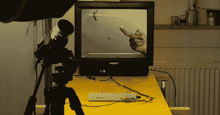

# 增强现实游戏可能来自七十年代

> 原文：<https://hackaday.com/2011/07/05/augmented-reality-game-could-come-from-the-seventies/>

[Niklas Roy]发来了他刚刚完成的一个项目，名为 [PING！增强像素](http://www.niklasroy.com/project/101/PING)。乍一看，整个建筑只是一个简单的简复古视频游戏，被塞进了 ATmega8，但外表可能具有欺骗性。视频游戏实际上是一种增强现实设备，它将一个像素插入到视频内容中。跳动的像素可以用相机来控制——推动像素，它就会向另一个方向消失。

该项目在一个时钟频率为 16 MHz 的 ATmega8 上运行，并在一个 [LM1881 同步分隔符](http://www.national.com/mpf/LM/LM1881.html#Overview)的帮助下读取视频馈送。没有原理图，但他谢天谢地为他的项目包含了一些[代码](http://niklasroy.com/codes/ping.txt)。一切都是为 PAL 视频设置的，但这可以很容易地适应 NTSC。任何黑客一天的读者想接受挑战，建立这只是一个描述？

[Niklas]说这没有理由不是 Atari 在 70 年代末做的。当然，没有推出摄像机控制器是有经济原因的，而且 R&D 的部门可能太忙了，忙着用他们的眉毛玩越狱游戏。

休息后，查看增强像素的演示。

[https://www.youtube.com/embed/eeuaqSEIiTY?version=3&rel=1&showsearch=0&showinfo=1&iv_load_policy=1&fs=1&hl=en-US&autohide=2&wmode=transparent](https://www.youtube.com/embed/eeuaqSEIiTY?version=3&rel=1&showsearch=0&showinfo=1&iv_load_policy=1&fs=1&hl=en-US&autohide=2&wmode=transparent)