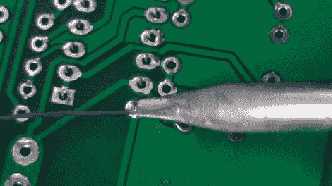

# 电子教程 2-fer:焊接技巧和电线

> 原文：<https://hackaday.com/2011/07/05/electronics-tutorial-twofer-soldering-skills-and-wires/>

网上散布着大量的电子教程。有时很难区分好的和坏的，有启发性的和错误的信息。我们最近发现了一对有用的眼镜，并认为它们会吸引任何开始接触电子产品的人。

[在本视频教程](http://www.eevblog.com/2011/07/02/eevblog-183-soldering-tutorial-part-2/)中，EEVblog 的【达夫·琼斯】讲述了焊接，详细介绍了使用通孔元件时应避免的良好做法和常见错误。作为系列的第二个视频[，他从第一部分停止的地方继续](http://www.eevblog.com/2011/06/19/eevblog-180-soldering-tutorial-part-1-tools/)，兴奋地展示良好焊接技能的来龙去脉。

Hackaday reader [grenadier]正在编写一系列初级电子教程，本周的条目包括布线。他讨论了电线的类型、规格，甚至提供了一个漂亮的计算图表，可以根据所选电线的长度和规格计算功率损耗。在总结之前，他简要地谈到了保险丝和选择不适合手头任务的电线的陷阱。当你在那里看他的教程时，[一定要去看看垃圾箱](http://www.junkbox.org/index.php)，那里有很多令人敬畏的东西！