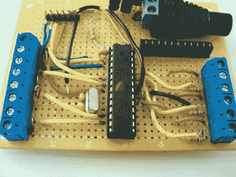

# DIY 温室的湿度控制

> 原文：<https://hackaday.com/2011/07/06/moisture-control-for-a-diy-greenhouse/>

[Clover]热爱植物生物学，大学放假在家时，她会照料一个小花园。她说，在照料植物方面，她的家庭是出了名的不可靠，所以她决定建造一个温室，以确保她下次回家时，她的花园还在。

她建起了自己的养床花园，种下了种子，她开始着手建造自己的温室，这是用 PVC 管和透明塑料布建造的。对这个结构的设计感到满意后，她把注意力放在了温室的灌溉系统和湿度传感器上。给水系统使用连接到一对 Arduino 调节继电器的螺线管。Arduino 使用钉子制成的湿度传感器，当东西变得太干时会触发水流。

控制器及其 LCD 状态面板安装在鸟舍内，以保护它免受自然环境的影响，同时与房子的装饰保持一致。[三叶草]似乎很高兴与建设，但我们怀疑她会增加一些温度和调节在某个时候，以促进更长的生长周期。

查看下面的视频，快速浏览她的设置。

 <https://www.youtube.com/embed/hdojUHjg35g?version=3&rel=1&showsearch=0&showinfo=1&iv_load_policy=1&fs=1&hl=en-US&autohide=2&wmode=transparent>

 </body> </html>