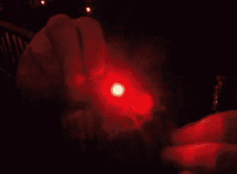

# 在红牛创造挑战赛上的黑客和滚动

> 原文：<https://hackaday.com/2011/07/07/hacking-and-rolling-at-the-red-bull-creation-challenge/>

哈佛黑客空间的工作人员运用他们的智慧和创造力，在红牛创造挑战的最后一轮中获得了一席之地。该团队昨天刚刚抵达布鲁克林，准备迎接今天早上开始的 72 小时黑客挑战。

像任何其他黑客大会一样，红牛挑战赛有自己独特的嘉宾徽章，只求被戳、被刺激或被愚弄。当团队到达纽约时，他们得到了他们的，在开幕式结束后，黑客攻击开始了。这些徽章通过一个红色 LED 发出看起来像莫尔斯电码的信息，当团队的一部分人努力记录和解码信息时，其他人开始对徽章的板上图片进行逆向工程。

他们成功地绕过了 PIC 的保险丝来读取里面的代码，他们发现这非常有趣。你将不得不按照上面的链接来找出它是什么，但请放心，红牛的人绝对有一个体面的幽默感。