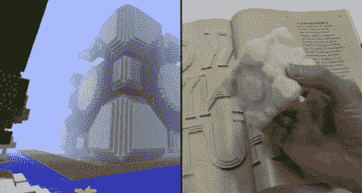

# 《我的世界》现在是一个三维设计工具

> 原文：<https://hackaday.com/2011/07/07/minecraft-is-now-a-3d-design-tool/>

[科迪·萨姆特]和[杰森·博格斯]是麻省理工学院媒体实验室的学生，他们刚刚想到了[《我的世界》。Print()](http://minecraftprint.com/) ，试图通过 3D 打印机在《我的世界》和现实世界之间架起一座桥梁。

首先，在《我的世界》，将黑曜石、钻石、黄金和铁块放在模型的相对角上，准备好印刷品。从那里，Python 脚本接管并解析世界地图以生成。RepRap 或 MakerBot 的 STL 文件。

到目前为止，[Cody]和[Jason]已经打印了一些配套的立方体和企业 d 的模型。我们对打印的分辨率印象深刻，尤其是考虑到原始模型是体相关的。打印出来的东西看起来非常好，现在我们真的想打印出所有我们见过的酷东西，比如[艾辛格](http://www.reddit.com/r/Minecraft/comments/e03ao/no_this_is_isengard/)、[巨型 CPU](http://www.youtube.com/watch?v=yuMlhKI-pzE) ，或者也许是[《我的世界》3D 打印机](http://www.youtube.com/watch?v=l0i8gUK1cVw)。

《我的世界》。Print()确实是[Cody]和[Jason]的一个不错的程序。如果它出了什么事，那就太可惜了。休息之后，请观看视频演示。

 <https://www.youtube.com/embed/7CLfNIZ4LNo?version=3&rel=1&showsearch=0&showinfo=1&iv_load_policy=1&fs=1&hl=en-US&autohide=2&wmode=transparent>

 

 

 </body> </html>